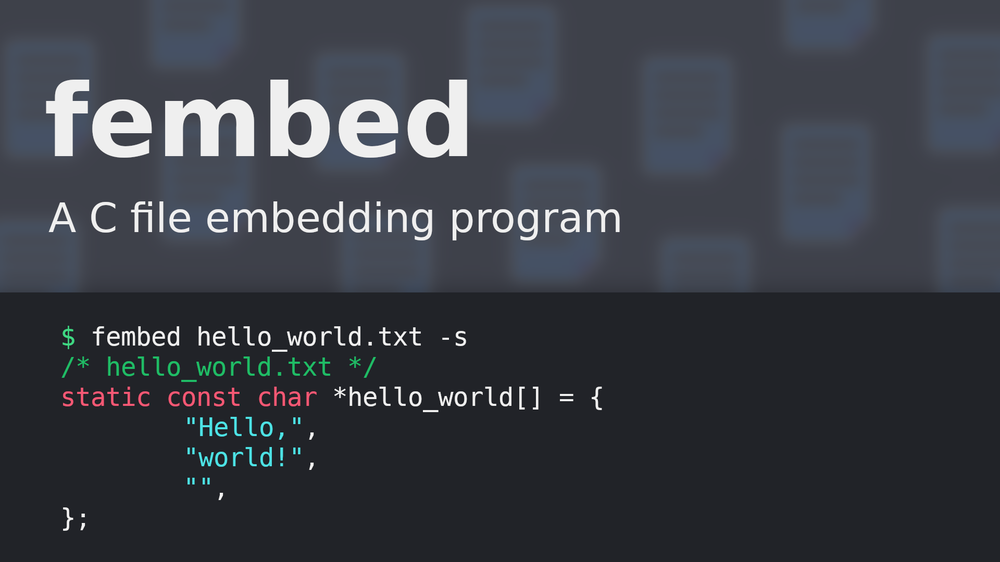

<h1 align="center">fembed</h1>
<p align="center">C file embedder</p>

<p align="center">
	<a href="./LICENSE">
		
	</a>
	<a href="https://github.com/LordOfTrident/fembed/issues">
		
	</a>
	<a href="https://github.com/LordOfTrident/fembed/pulls">
		
	</a>
	<br><br><br>
	
</p>

## Table of contents
* [Introduction](#introduction)
* [Quickstart](#quickstart)
* [Bugs](#bugs)
* [Make](#make)

## Introduction
A simple C file embedder that can embed into a byte array or an array of strings

## Quickstart
```sh
$ make
$ make install
$ fembed -h
```

## Bugs
If you find any bugs, please create an issue and report them.

## Make
Run `make all` to see all the make rules.
